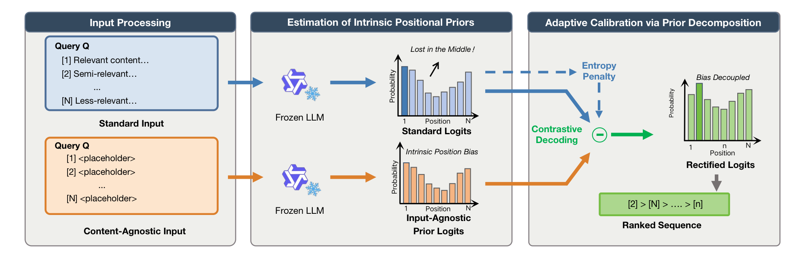

# CapCal: Learning from Emptiness

[](https://ustc-starteam.github.io/CapCal/)
[](https://arxiv.org/abs/2604.10150)
[](https://arxiv.org/abs/2604.10150)
[](https://www.python.org/)

Official code for **"Learning from Emptiness: De-biasing Listwise Rerankers with Content-Agnostic Probability Calibration"**.

The paper studies a core failure mode of listwise LLM rerankers: even when the candidate set is semantically identical, the model may still prefer some list positions over others. Our method, **CapCal**, treats this behavior as an explicit prior, estimates it from content-agnostic inputs, and subtracts it during decoding. The public release of this repository keeps the code needed to reproduce the paper's results.

## 1. Paper

Hang Lv, Hongchao Gu, Ruiqing Yang, Liangyue Li, Zulong Chen, Defu Lian, Hao Wang, and Enhong Chen. **Learning from Emptiness: De-biasing Listwise Rerankers with Content-Agnostic Probability Calibration.** ACL 2026, 2026.

[Paper](https://arxiv.org/abs/2604.10150) / [PDF](https://arxiv.org/pdf/2604.10150) / [Project Page](https://ustc-starteam.github.io/CapCal/) / [Code](https://github.com/USTC-StarTeam/CapCal) / [Citation](#citation)

CapCal is a training-free calibration method for listwise LLM rerankers. It estimates the reranker's content-agnostic positional prior using placeholder passages, then calibrates output probabilities so ranking decisions rely less on structural position bias.

## 2. Highlights

- Estimates listwise reranker position bias with content-agnostic inputs.
- Calibrates ranking probabilities during decoding without model retraining.
- Supports both fixed and adaptive calibration strategies.
- Includes public scripts for Qwen reranking experiments and BM25 baselines.

## 3. Method At A Glance



CapCal is a **training-free calibration framework** for listwise reranking.

Given a query and a list of candidate passages, we run the frozen reranker twice:

1. **Standard input**: the original query and candidate passages.
2. **Content-agnostic input**: the same query and the same passage identifiers, but every passage body is replaced with a placeholder.

The second pass exposes the model's **input-agnostic positional prior**. Intuitively, if the model still prefers some document indices when the content is empty, that preference is structural bias rather than semantic relevance.

CapCal then calibrates the ranking score by subtracting the excessive prior component from the standard probability:

```text
S(d_i) = P(d_i | x) - α · (P(d_i | x_empty) - 1 / |C_k|)
```

where:

- `P(d_i | x)` is the identifier-level probability under the original prompt,
- `P(d_i | x_empty)` is the identifier-level probability under the placeholder prompt,
- `|C_k|` is the number of remaining candidates at decoding step `k`,
- `α` is the calibration strength.

This repository includes the two variants reported in the main paper:

- **Fixed calibration**: uses a constant `α`.
- **Adaptive calibration**: adjusts `α` from model uncertainty, using the entropy of the current candidate distribution.

To make decoding valid for listwise ranking, the implementation also uses **constrained decoding**, so the model always produces a legal permutation of document identifiers.

## 4. Repository Structure and Implementation

The release is intentionally narrow: it focuses on the paper's main experimental surface rather than every exploratory branch developed during the project.

```text
.
├── code/
│   ├── dataloader/         # TREC-COVID and TREC-DL loaders
│   ├── main/               # main experiment entry points and BM25 baseline
│   ├── scripts/            # public Qwen experiment wrappers
│   └── src/                # CapCal decoding, calibration, metrics, utilities
├── docs/
│   ├── assets/             # figures used in the documentation
│   └── REPRODUCTION.md     # compact reproduction guide
├── data/                   # expected data root (not versioned)
├── results/                # generated outputs
└── requirements.txt
```

The most important files are:

- `code/src/llm_utils.py`: the retained CapCal implementations.
  - `LLMExp_FixedBias`
  - `LLMExp_AdaptiveBias`
- `code/main/main.py`: the main runner for reranking experiments.
- `code/main/calculate_bm25_baseline.py`: BM25 baseline computation.
- `code/scripts/run_qwen_suite.sh`: shared shell runner used by all public model wrappers.
- `code/scripts/qwen*_fixed.sh` and `code/scripts/qwen*_adaptive.sh`: ready-to-run scripts for the Qwen models used in the paper.

The public experiment surface now includes only:

- **Models**: Qwen2.5-7B-Instruct, Qwen3-0.6B, Qwen3-1.7B, Qwen3-4B, Qwen3-8B
- **Datasets**: TREC-COVID, TREC DL 2019, TREC DL 2020, TREC DL 2021, TREC DL 2022, TREC DL 2023
- **Methods**: fixed calibration, adaptive calibration, BM25 baseline

## 5. Installation

We recommend **Python 3.10**.

```bash
conda create -n rerank-bias python=3.10 -y
conda activate rerank-bias
pip install -r requirements.txt
```

`requirements.txt` is intentionally minimal and contains only the core runtime packages needed for the public release:

- `torch`
- `transformers`
- `numpy`
- `PyYAML`
- `tqdm`
- `beir`
- `rank-bm25`
- `ir-measures`

If you want a compact step-by-step runbook, see [docs/REPRODUCTION.md](docs/REPRODUCTION.md).

## 6. Data Layout

All loaders resolve datasets relative to `RERANK_BIAS_DATA_ROOT`. If the variable is unset, the repository defaults to `./data`.

```bash
export RERANK_BIAS_DATA_ROOT=/path/to/your/data
export RERANK_BIAS_HF_HOME=$RERANK_BIAS_DATA_ROOT/huggingface
```

Expected layout:

```text
$RERANK_BIAS_DATA_ROOT/
├── beir/
│   └── trec-covid/
├── trec-dl-2019/
├── trec-dl-2020/
├── trec/
│   ├── trec21/
│   ├── trec22/
│   └── trec23/
└── msmarco_v2_passage/
```

### TREC-COVID

You can download the BEIR-formatted `trec-covid` data with:

```bash
python code/dataloader/download_datasets.py --datasets trec-covid
```

### TREC-DL

TREC DL data is expected locally:

- `dl19` → `$RERANK_BIAS_DATA_ROOT/trec-dl-2019`
- `dl20` → `$RERANK_BIAS_DATA_ROOT/trec-dl-2020`
- `dl21` → `$RERANK_BIAS_DATA_ROOT/trec/trec21`
- `dl22` → `$RERANK_BIAS_DATA_ROOT/trec/trec22`
- `dl23` → `$RERANK_BIAS_DATA_ROOT/trec/trec23`

For `dl21`, `dl22`, and `dl23`, the loader also needs the MSMARCO v2 passage collection:

```bash
export RERANK_MSMARCO_V2_PASSAGE_DIR=/path/to/msmarco_v2_passage
```

If this variable is unset, the loader will look for `msmarco_v2_passage` under `RERANK_BIAS_DATA_ROOT`.

## 7. Running the Released Experiments

### 1. Verify the environment and dataset path

```bash
python code/main/main.py \
  --dataset_type beir \
  --dataset_name trec-covid \
  --num_queries 10 \
  --dry_run
```

### 2. Run fixed calibration

```bash
bash code/scripts/qwen3_1_7b_fixed.sh
```

### 3. Run adaptive calibration

```bash
bash code/scripts/qwen3_1_7b_adaptive.sh
```

### 4. Override datasets or calibration strengths

```bash
NUM_QUERIES=100 \
BIAS_RATES="1.0 1.5 2.0" \
TREC_DL_DATASETS="dl21 dl22 dl23" \
BEIR_DATASETS="trec-covid" \
bash code/scripts/qwen3_4b_fixed.sh
```

### 5. Compute BM25 baselines

```bash
bash code/scripts/calculate_bm25_baseline_all.sh
```

## 8. Outputs

By default:

- Qwen experiment outputs are written under `results/qwen/`
- BM25 outputs are written under `results/bm25_baseline/`

## 9. Notes For Maintainers

- Keep generated outputs under `results/` and out of Git history unless they are curated release artifacts.
- Store new README/project-page figures under `docs/assets/`.
- Add ACL Anthology, slides, poster, or video links when official presentation materials become public.

<a id="citation"></a>

## 10. Citation

If you use this repository, please cite:

```bibtex
@misc{lv2026capcal,
  title={Learning from Emptiness: De-biasing Listwise Rerankers with Content-Agnostic Probability Calibration},
  author={Hang Lv and Hongchao Gu and Ruiqing Yang and Liangyue Li and Zulong Chen and Defu Lian and Hao Wang and Enhong Chen},
  year={2026},
  eprint={2604.10150},
  archivePrefix={arXiv},
  primaryClass={cs.AI},
  url={https://arxiv.org/abs/2604.10150},
}
```

## 11. Contact

For paper questions, please contact:

- Co-first authors: Hang Lv and Hongchao Gu.
- Corresponding author: Hao Wang (`wanghao3@ustc.edu.cn`)

For repository issues, please open a GitHub issue in this repository.
